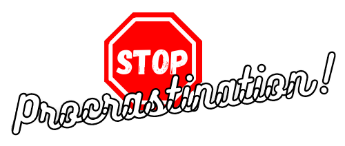

#Stop Procrastination!

###A Chrome extension that tries to stop procrastination.
#####My final project for CS50's Introduction to computer science course by HarvardX

It has a list of sites, which can be customized. When the extension is turned on, if you enter one of
the sites in the list, a message is displayed, telling you to stop procrastinating, unless you turn off
the extension, the messages will not stop being displayed.
---------------------------------------------------------------------------------------------------------

###Table of contents

[About](#stop procrastination!)
[What is](#what is)
[Features](#features)
[How to run](#how to run)
[Video](#video)
[Author](#auhtor)

###What is

####backgorund.js
This file is what allows the communication between the chrome tabs and the extension. It checks when
one of the registered sites is opened, and then triggers the message, if the extension is on.

####manifest.json
This file is the "skeleton" of the extension, it contains all the details and specifications
about it, in json format. Without it, chrome cannot build the extension.

####popup.html
This file is the structure of the user interface, it has all the elements that will be presented in html.

####popup.css
This file is the user interface style, here are inserted colors, shapes, sizes and positions for each
element existing in the html file.

####popup.js
This file is what contains all the logic of the user interface: what the buttons do when they are clicked,
how the sites are customized, screen changes, etc.

####images
This folder contains all the images used in the extension, in the user interface, as well as the icons presented in chrome

###Features

 - [x] Customize websites
 - [x] Enable and disable extension
 - [x] Display a message when active and on one of the registered sites
 - [ ] Option to block registered sites

###How to run
Unfortunately, I haven't been able to publish it to the chrome web store yet, so for now you'll have to:

- Install the project
- Go to chrome://extensions/
- In the upper right corner, turn on Developer Mode
- Click "load without compression"
- Find and select the extension folder

That's it, now you can open it on your own machine as any other extension and edit it in your code editor

###Video
[This is](https://youtu.be/5t_cCtUJYG0) the link to my explanatory video about the project, required by the course:

###Author
Taissa Silva

